# Career मार्ग: Multimodal AI Career Preparation & Intelligence Suite

> **Tagline:** *Apne Career ko do Raasta*

**Career मार्ग** is an executive multimodal AI career preparation platform built to empower students and job seekers through high-fidelity resume document understanding, ATS compatibility optimization, skill gap analysis, personalized interview preparation, text-based interactive mock interviews, career role matching, targeted portfolio project recommendations, industry readiness scoring, and grounded professional branding generation.

---

## 🌟 Key Features & Capability Matrix

1. **Multimodal Resume Upload & Document Layout Understanding**:
   - Supports **Digital PDFs**, **Scanned PDFs**, and **Image Resumes (JPG, JPEG, PNG)**.
   - Powered by **Mistral OCR 3** for high-fidelity text, markdown, table, column, and visual layout extraction with local fallback capabilities.
   - Structuring into Pydantic JSON schemas, clearly separating candidate facts explicitly found in the resume from AI recommendations.

2. **ATS Compatibility Optimization**:
   - Transparent 5-factor scoring algorithm (Required Skills 40%, Keyword Match 25%, Experience 15%, Education 10%, Document Structure 10%).
   - Displays matching & missing keywords, formatting warnings, and action-verb bullet point improvement recommendations with quantifiable placeholders.

3. **Skill Gap Analysis & Personalized Learning Roadmap**:
   - Categorizes skills into Strong Match, Partial Match, Missing Skills, and Additional Skills.
   - Generates a prioritized learning roadmap with learning topics, resources, and hands-on project suggestions.

4. **Personalized Interview Question Generator**:
   - Tailors non-generic questions across 6 categories: Technical, Project-Based, Resume-Based, Behavioral, HR, and Skill-Gap.

5. **Text-Based Interactive Mock Interview Engine**:
   - One-question-at-a-time interactive simulator evaluating Relevance, Technical Correctness, Completeness, and Clarity.
   - Provides immediate feedback, missing key points, and dynamic follow-up questions.

6. **Career Role Recommendations & Industry Readiness Score**:
   - Evaluates match percentages against industry benchmark roles.
   - Calculates a transparent Industry Readiness Score (0-100) across 6 core weighted categories.

7. **Portfolio Project Recommendation Engine**:
   - Suggests targeted, portfolio-ready project architectures designed specifically to cover identified skill gaps.

8. **Grounded Professional Profile Generator**:
   - Generates tailored Resume Summaries, LinkedIn headlines, LinkedIn About sections, Portfolio bios, and GitHub profile descriptions.
   - Strictly grounded in candidate resume facts — never fabricates experience or credentials.

---

## 📸 Application Screenshots & Page Previews

### 1. Executive Landing Page & Platform Blueprint
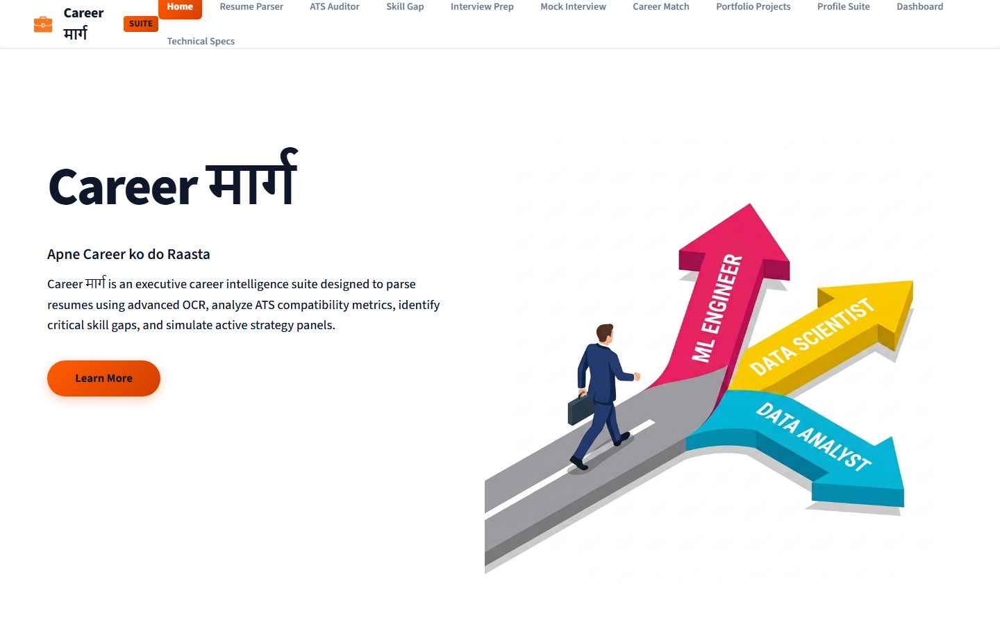

### 2. Resume Upload & Multimodal OCR Understanding
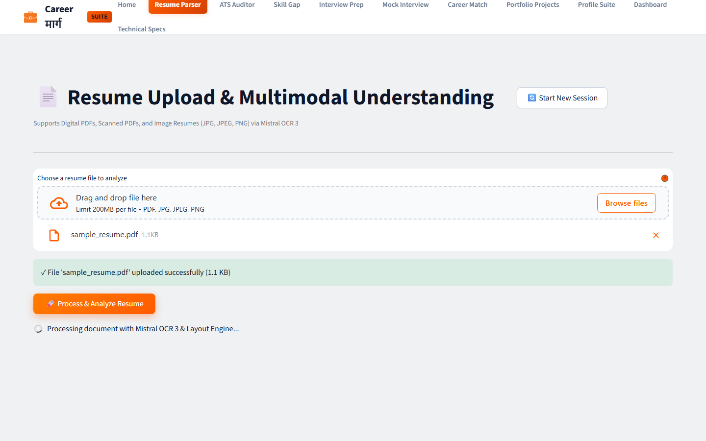

### 3. ATS Compatibility Optimization & Keyword Scoring
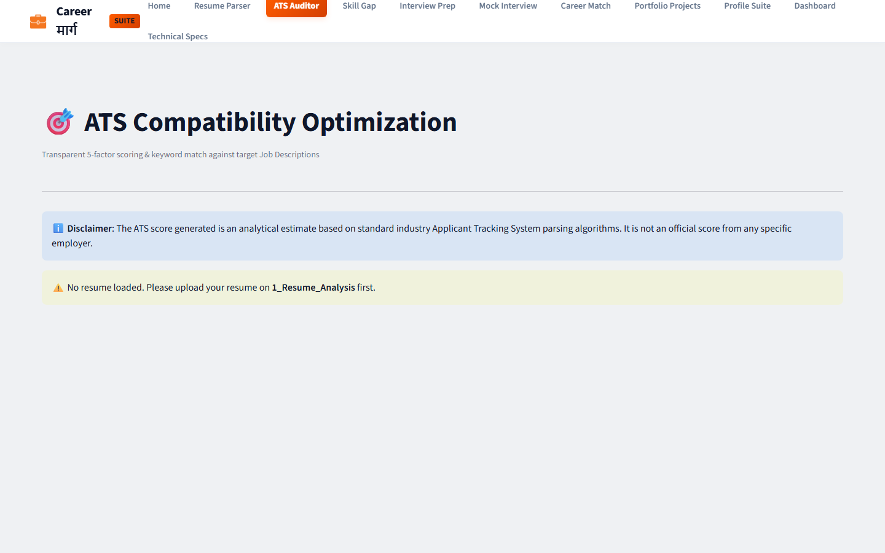

### 4. Skill Gap Analysis & 30-Day Learning Roadmap
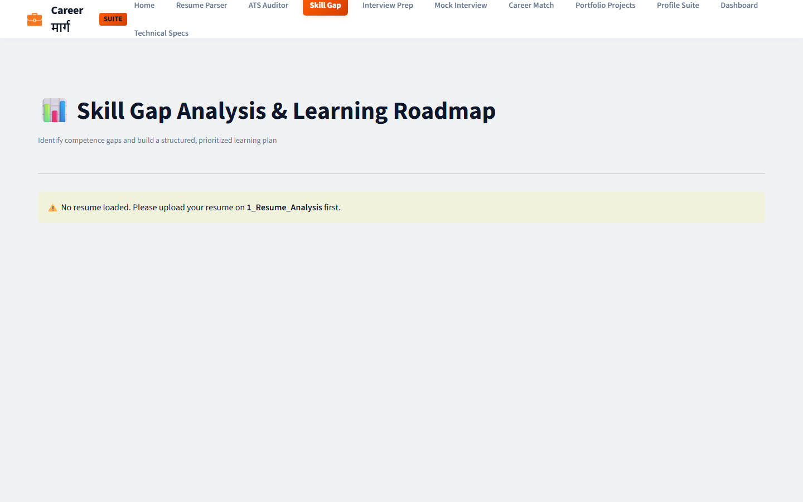

### 5. Personalized Interview Question Generator (6 Categories)
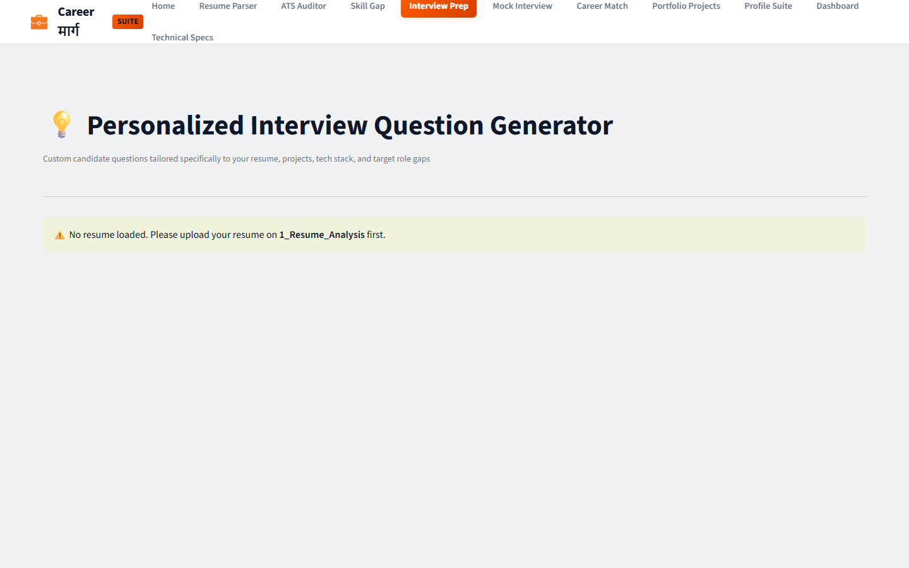

### 6. Interactive Text-Based Mock Interview Engine
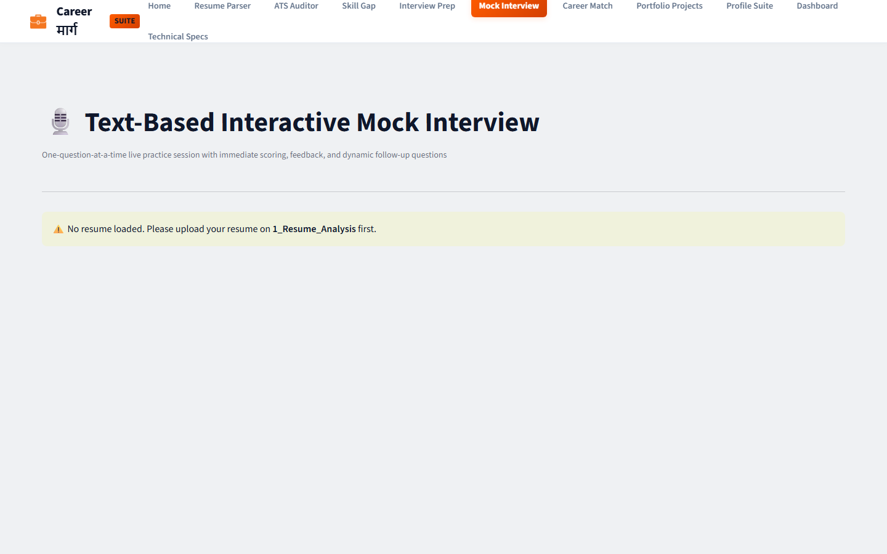

### 7. Career Role Match Recommendations & Benchmark Scoring
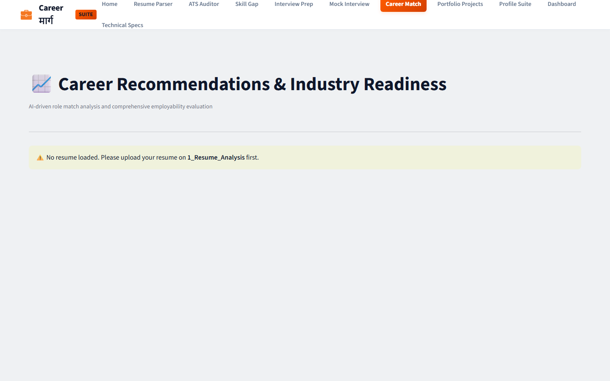

### 8. Targeted Portfolio Project Recommendation Engine
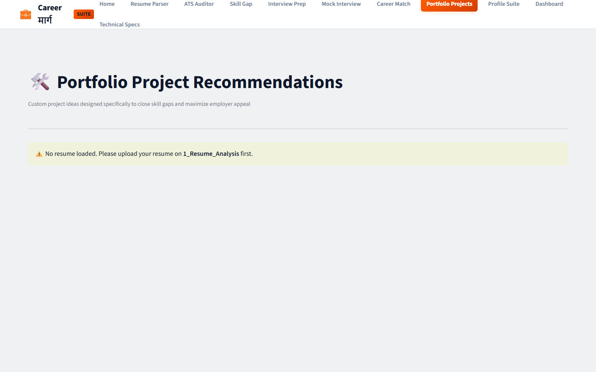

### 9. Grounded Professional Profile Generator
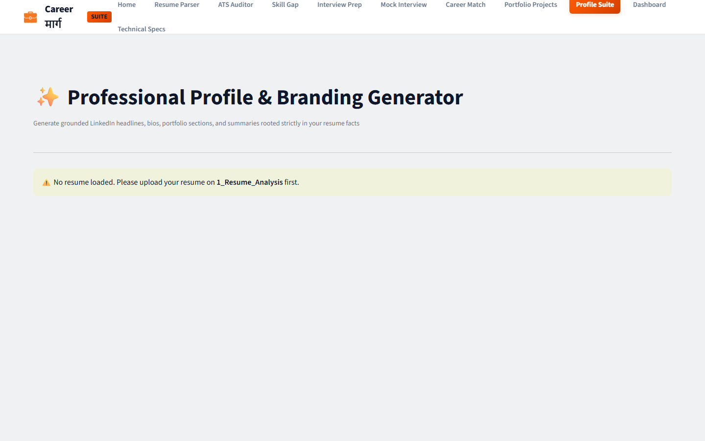

### 10. Multi-Graph Executive Analytics Dashboard
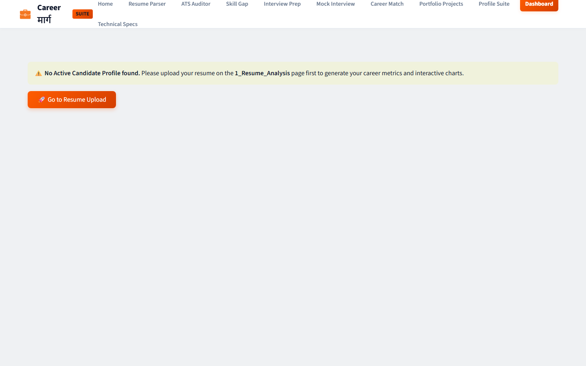

### 11. Technical Architecture & System Specifications
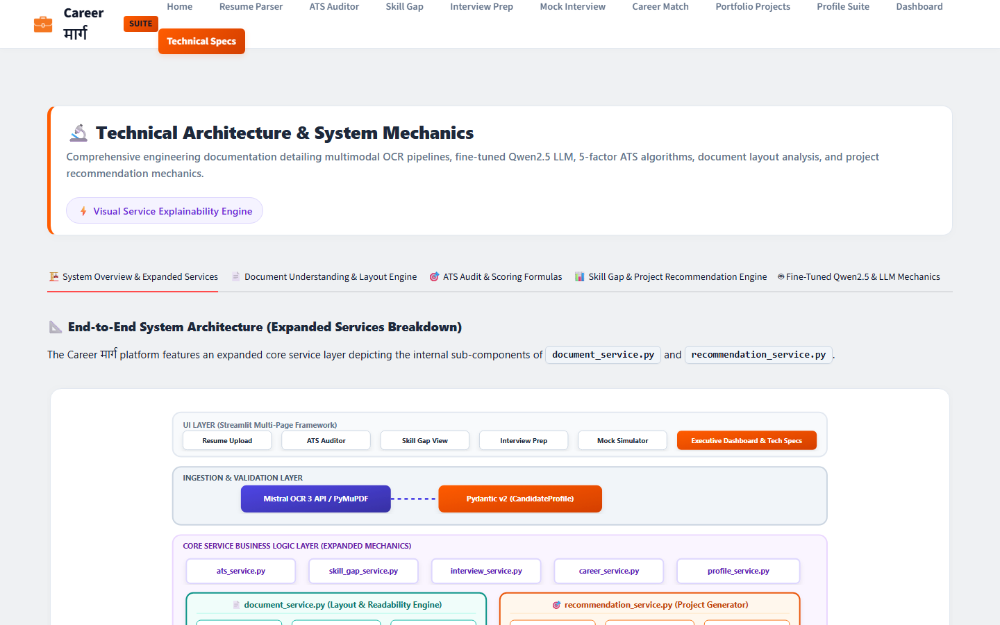

---

## 🛠️ Architecture & Technology Stack

- **UI Layer**: Streamlit with custom executive CSS design system, Plotly visualization, custom multi-page navigation header.
- **Service Layer**: Decoupled Python Services (`mistral_ocr_service`, `document_service`, `resume_parser`, `llm_service`, `ats_service`, `skill_gap_service`, `interview_service`, `career_service`, `recommendation_service`, `profile_service`).
- **Document OCR**: Mistral OCR 3 API (`MISTRAL_API_KEY`) with PyMuPDF / PIL local fallback engines.
- **AI Reasoning**: Flexible LLM provider abstraction supporting Mistral API, OpenAI, Ollama, and local heuristic NLP.
- **Storage Layer**: SQLite database via SQLAlchemy (`data/database.py`).
- **Data Validation**: Pydantic v2 schemas (`models/schemas.py`).

---

## 🚀 Quick Start Guide

### 1. Clone & Set Up Environment
```bash
git clone https://github.com/AnuragChowdhury/Career-Marg.git
cd Career-Marg
python -m venv venv
# On Windows:
venv\Scripts\activate
# On Linux/macOS:
source venv/bin/activate
```

### 2. Install Dependencies
```bash
pip install -r requirements.txt
```

### 3. Configure Environment Variables
Copy `.env.example` to `.env` and fill in your API key:
```env
MISTRAL_API_KEY=your_mistral_api_key_here
LLM_PROVIDER=mistral
DATABASE_URL=sqlite:///./data/careermarg.db
```

### 4. Run Automated Unit Tests
```bash
python -m unittest discover tests
```

### 5. Launch Streamlit Application
```bash
streamlit run app.py
```

---

## 📤 Push to GitHub Instructions

To upload this repository to your GitHub account ([@AnuragChowdhury](https://github.com/AnuragChowdhury)):

1. **Create a new repository on GitHub**:
   Go to [https://github.com/new](https://github.com/new) and name it `Career-Marg` (or your preferred name). Leave it empty (do not initialize with README/gitignore).

2. **Run Git Commands in your local terminal**:
   ```bash
   git init
   git add .
   git commit -m "Initial commit: Career मार्ग Multimodal AI Career Assistant with full documentation & page screenshots"
   git branch -M main
   git remote add origin https://github.com/AnuragChowdhury/Career-Marg.git
   git push -u origin main
   ```

---

## 📁 Repository Structure

```text
Career-Marg/
├── app.py                         # Main Streamlit Executive Landing Page
├── pages/
│   ├── 1_Resume_Analysis.py       # Resume Upload, OCR View & Candidate Profile Parsing
│   ├── 2_ATS_Analysis.py          # Job Description Input & ATS 5-Factor Compatibility
│   ├── 3_Skill_Gap_Analysis.py     # Skill Categorization & 30-Day Action Roadmap
│   ├── 4_Interview_Preparation.py # Personalized Question Set Generator
│   ├── 5_Mock_Interview.py        # 1-Question Interactive Mock Interview Simulator
│   ├── 6_Career_Recommendations.py# Career Role Matching & Industry Readiness Score
│   ├── 7_Project_Recommendations.py# Tailored Project Ideas to Fill Identified Skill Gaps
│   ├── 8_Profile_Generator.py     # Grounded Resume Summaries, LinkedIn & Bio Generator
│   ├── 9_SaaS_Dashboard.py        # Multi-Graph Executive Analytics Dashboard
│   └── 10_Technical_Architecture.py# Full System Architecture & Data Model Specs
├── services/                      # Decoupled Business Logic & AI Services
│   ├── mistral_ocr_service.py     # Mistral OCR 3 API integration & fallbacks
│   ├── document_service.py        # Visual layout structure analysis
│   ├── resume_parser.py           # Structuring raw text into Pydantic Candidate Profile
│   ├── llm_service.py             # Flexible LLM Abstraction (Mistral, OpenAI, Ollama, Local)
│   ├── ats_service.py             # Transparent ATS Scoring & keyword match engine
│   ├── skill_gap_service.py       # Skill gap categorizer & roadmap generator
│   ├── interview_service.py       # Question set generator & mock interview evaluator
│   ├── career_service.py          # Role recommendation & industry readiness engine
│   ├── recommendation_service.py  # Portfolio project generator
│   └── profile_service.py         # Grounded professional summary & social profile generator
├── assets/
│   └── screenshots/               # Full-page high-resolution page previews
├── models/
│   └── schemas.py                 # Pydantic schemas for Profile, ATS, Gaps & Interviews
├── utils/
│   ├── scoring.py                 # Mathematical formula implementations
│   └── helpers.py                 # Session state management, text cleanups & CSS theme
├── data/
│   └── database.py                # SQLite database layer with SQLAlchemy
├── tests/
│   └── test_services.py           # Automated unit tests
├── requirements.txt
├── .env.example
├── .gitignore
└── README.md
```

---

## 📄 License & Attribution

Developed as an AI/ML & LLM Capstone Project by **Anurag Chowdhury** ([GitHub: @AnuragChowdhury](https://github.com/AnuragChowdhury)).
